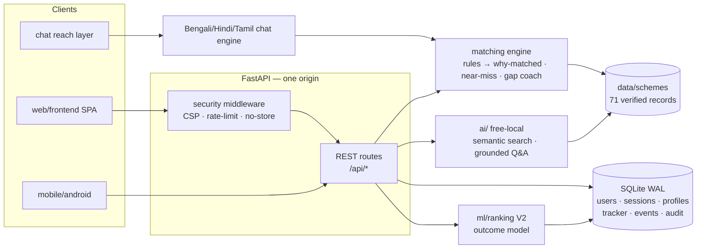

<div align="center">


# 🎓 FeeFix India

### Find the funding you qualify for.

**Personalized scholarship & fee-waiver matching platform for Indian students.**

Instead of *"Where can I find scholarships?"* — FeeFix answers
**"Which schemes fit my profile, why do I qualify, and what should I do next?"**

[](https://github.com/authorsauravkushwaha/feefix-india/actions)
[](#-testing)
[](#-the-dataset)
[](#-four-languages-native-script)
[](docs/security/SECURITY.md)
[](ai/README.md)
[](#)
[](#)
[](LICENSE)

</div>

---

FeeFix is a **decision engine, not a search engine**. A student answers a few
guided questions and gets a personalised, *ranked* set of scholarships and fee
waivers — **every match explained, every deadline tracked, every application
nudged along**, with accounts that carry their data across devices.

The dataset ships verified for **10 states + the North-East (Ishan Uday) +
national schemes** — 71 records, machine-validated in CI.

## 📲 Open the app on your phone

| What | Where |
|---|---|
| **Live web app** | Deploy **free in 5 minutes** — [`docs/deploy/DEPLOYMENT.md`](docs/deploy/DEPLOYMENT.md) (Render / Fly.io / HF Spaces free tiers). One command, one origin, opens in any phone browser → *Add to home screen* = instant app. |
| **Android app** | [`mobile/android/`](mobile/android/) — Kotlin/Compose scaffold on the same API; build in Android Studio → APK. |
| **Run locally** | `./scripts/dev.sh` → `http://localhost:8000` |

> **Try without installing anything:** the API design means any free Python
> host serves the full product (web *and* API on one URL). The deploy guide
> has copy-paste configs — then paste that URL into this repo's **Website**
> field so anyone can open it directly.

## 🎬 The product in 10 seconds

<p align="center">
</p>

Wizard → explainable ranked matches → dashboard (tracker, reminders, sign-in)
→ Ask FeeFix (grounded AI answers with citations) → chat in your own script.

## ✨ What's inside

| Layer | Where | What it does |
|---|---|---|
| **Web experience** | `web/frontend/` | Full product, no build step: guided **Smart Matcher** wizard → explainable ranked results → scheme drawer → dashboard with tracker & reminders → **Ask FeeFix** AI panel → **🔐 accounts** (your data follows your login on any device). |
| **Matching engine** | `backend/matching_engine/` | Transparent rule engine: `pass / fail / unknown` semantics — unknowns never disqualify, they become *"verify these"* assumptions. **Why-you-match** reasons · **near-miss detection** + **gap coaching**. Every rule result carries parameter slots for localization. |
| **Ranking** | `backend/matching_engine/ranker.py` | `45·clarity + urgency + benefit + verified`, deadline-aware, badges. |
| **Free-local AI** | `ai/` | Semantic search + **grounded Q&A with citations** — answers assembled only from verified dataset fields (+ near-miss radar). In-process embeddings (`fastembed`/MiniLM or built-in sublinear-TF n-gram embedder). **No paid APIs, ever.** |
| **ML outcome ranking (V2)** | `ml/ranking/` · `POST /api/events` · `GET /api/ml/rank` | Tracker buttons (`viewed/applied/approved/…`) stream outcome events with their V1 signal snapshots → tiny logistic model re-ranks matches (**⚡ ML preview** toggle, synthetic bootstrap until ≥25 real events). *Same signals V1 uses — no invented facts.* |
| **Security & accounts** | `backend/services/auth.py` · `db.py` · `ratelimit.py` · `secure_headers.py` | PBKDF2-SHA256 passwords (600k rounds, per-user salt) · SHA-256-hashed revocable session tokens · sliding-window rate limits · CSP/HSTS/nosniff/no-store headers · CORS closed by default · append-only audit log · uniform login errors · **data export + right-to-erasure**. → [`docs/security/SECURITY.md`](docs/security/SECURITY.md) |
| **Storage** | `backend/services/sqlite_store.py` | **SQLite (WAL mode)** — ACID, crash-safe, indexed, FK-enforced, versioned migrations, legacy JSONL auto-import. Postgres swap = one module (documented). |
| **Data & verification** | `data/` | 71 curated schemes as structured, validated records + per-record **verification manifest**; `agents/verify_dataset.py` gates CI. |
| **Reach layer** | `backend/services/chat.py` + `chat_i18n.py` | WhatsApp-style conversational matcher — *State → Course → Income → matches → free-text Q&A* — in **English, বাংলা, हिन्दी & தமிழ்** (native script detection, দেশি digits `২ লাখ`, Tamil `லட்சம்`, NFC-safe matching). |
| **Agents** | `agents/` | Dataset verification agent (health audit + CI gate) · reminder scheduler (cron-friendly dispatcher). |
| **Notifications** | `backend/notifications/` | Channel-agnostic reminders (console + WhatsApp outbox demo). |
| **Android** | `mobile/android/` | Kotlin/Compose reference scaffold on the same API contract. |
| **CI** | `.github/workflows/` | Tests + dataset agent + ML sanity + scheduler dry-run — free GitHub Actions. |

## 🗺 Architecture



## 🧠 A match, explained

```bash
curl -X POST http://localhost:8000/api/match -H 'Content-Type: application/json' \
  -d '{"profile": {"domicile_state": "West Bengal", "category": "obc",
       "annual_family_income": 95000, "course_level": "ug", "gender": "female",
       "last_exam_percentage": 71}}'
```

```
→ matches[0]: aicte-pragati  score 88
  why_matched:
    ✓ Your family income (₹95,000) is within the ₹8,00,000 limit.
    ✓ Your gender matches the scheme's requirement.
  badges: [top_pick, high_value, all_india, verified]   days_left: 34

→ near_misses[0]: nsp-central-sector
  single blocker: Needs ≥80% in the last exam; you reported 71.0%.
  gap advice: improve the score or target schemes without the merit bar →
```

## 🗣 Four languages, native script

The entire surface — UI, match explanations, and full chat conversations — runs in **English, বাংলা, हिन्दी and தமிழ்**:

```
🤖 *প্রশ্ন ১ / ৩:* আপনার অধিবাস কোন রাজ্যে?
👤 পশ্চিমবঙ্গ
🤖 ✅ ঠিক আছে: West Bengal। *প্রশ্ন ২ / ৩:* আপনি এখন কী পড়ছেন?
👤 বি.টেক
🤖 *প্রশ্ন ৩ / ৩:* বার্ষিক পারিবারিক আয়?
👤 ২ লাখ
🤖 🎯 আপনার প্রোফাইলের সাথে 6টি প্রকল্প মিলেছে। …
```

Native digits (২ লাখ / २ लाख / 2 லட்சம்), 30+ Bengali/Hindi/Tamil state names,
Unicode-NFC-safe keyword matching.

## 🗄 The dataset

**71 verified schemes:** West Bengal · Bihar · Odisha · Uttar Pradesh ·
Maharashtra · Jharkhand · Tamil Nadu · Assam · Karnataka · Kerala ·
North-East-wide Ishan Uday · national pool.

Every record carries: official portal link · benefit + display string ·
deadline or rolling flag · full eligibility DSL · documents · step-by-step
application guide · verification status (`verified` | `pending_review`) ·
last-verified date · curator notes where figures shift between cycles.
Invariant-tested in CI (unique ids, https sources, manifest coverage).

## 🚀 Quickstart

```bash
git clone https://github.com/authorsauravkushwaha/feefix-india.git
cd feefix-india
./scripts/dev.sh          # creates venv, installs deps, serves on :8000
# open http://localhost:8000
```

```bash
./scripts/dev.sh --test                       # 151 tests
.venv/bin/python -m agents.verify_dataset     # dataset health audit
.venv/bin/python -m ml.experiments.simulate_outcomes   # V2 ranker demo
```

## 🔐 Sign in once, keep your progress

Accounts are **optional** — everything works anonymously. Sign in and the
anonymous wizard session binds to your account: matches, tracker board and
reminders follow the login on any device. Log out → fresh anonymous session.
Export or erase your data anytime (`docs/api/API.md` → Accounts).

## 🧪 Testing

| Suite | Covers |
|---|---|
| `test_matching_engine` | rules, explanations, near-misses |
| `test_ranking` | scoring, deadlines, badges, determinism |
| `test_dataset` | 71-record integrity + per-state match scenarios |
| `test_api` · `test_ml_api` | REST contract, events, V2 compare endpoint |
| `test_auth` | register/login, token revocation, ownership 403s, rate limits, headers, export/erase, **no-plaintext-DB proof** |
| `test_chat` · `test_i18n_rules` | 4-language parsing + full conversations + localized explanations |
| `test_ai` · `test_agents` | grounding, search rankings, verifier, scheduler |

## 📁 Repository map

```
feefix-india/
├── backend/
│   ├── api/                 # routes + request schemas
│   ├── matching_engine/     # rules · engine · ranker  (the core)
│   ├── models/              # StudentProfile · Scheme (pydantic)
│   ├── services/            # dataset · matching · tracker(SQLite WAL) · chat · events ·
│   │                        # auth · db · ratelimit · secure_headers · i18n
│   ├── notifications/       # notifier abstraction + WhatsApp outbox
│   └── main.py              # FastAPI app (API + static SPA, one origin)
├── ai/                      # FREE-ONLY AI: lexicon · embeddings · search · grounded Q&A
├── agents/                  # dataset verification agent · reminder scheduler agent
├── data/
│   ├── schemes/             # 10 state files + national incl. NER Ishan Uday (71 schemes)
│   ├── eligibility_rules/   # the rule DSL documentation
│   └── verification/        # verification manifest
├── docs/                    # architecture · API · security · deploy · dataset schema
├── web/frontend/            # the FeeFix web experience (no build step)
├── mobile/android/          # Kotlin scaffold (same API contract)
├── ml/                      # V2 outcome ranker + experiments + events-trained service
├── language/regional_support/  # en/bn/hi/ta dictionaries + explanation templates
├── .github/workflows/       # CI: tests + agents + ML sanity (free for public repos)
├── scripts/dev.sh           # one-command dev bootstrap
└── tests/                   # 151 tests
```

## 🗺 Roadmap

- [x] **Phase 1 — West Bengal**: verified dataset, rule-based explainable matcher ✅
- [x] **Phase 2 — Multi-state + agents + free-local AI**: Bihar & Odisha, AI layer, verification agent, CI ✅
- [x] **Phase 3 — ML ranking**: outcome events + logistic reranker live behind ⚡ ML preview ✅
- [x] **Phase 4 — Language depth**: full conversations + localized explanations in Bengali/Hindi ✅
- [x] **Phase 5 — National footprint**: UP, Maharashtra, Jharkhand, Tamil Nadu, Assam, Karnataka, Kerala + Ishan Uday; Tamil as 4th language ✅
- [x] **v1.1 — Trust layer**: accounts & sign-in, CIA-mapped hardening, SQLite WAL, export/erasure ✅
- [ ] **Next** — more states (Gujarat, Rajasthan, MP…) + te/mr templates · deployed public link (see `docs/deploy/`) · college-partner dispatch channels · TOTP second factor

## ⚖️ Data disclaimer

Benefit amounts, cut-offs and deadlines in `data/` are indicative of recent
public cycles and marked with a curator `notes` field where they shift. Every
record carries an official source, a verification date and a status; always
verify on the official portal before applying. [`data/README.md`](data/README.md)
documents the verification workflow.

## 🤝 Contributing

Adding a state is a *data* contribution, not a code one — see
[`CONTRIBUTING.md`](CONTRIBUTING.md). Security issues: please use
[`docs/security/SECURITY.md`](docs/security/SECURITY.md) (private advisory, not public issues).

## 📄 License

[MIT](LICENSE) — free for students, forever. Built with free, open-source
tools only: no paid APIs, no API keys, no cloud bills.

---

<div align="center"><b>Discover. Understand. Apply. Track.</b><br>
<sub>Made in Kolkata, for every student in India.</sub></div>
